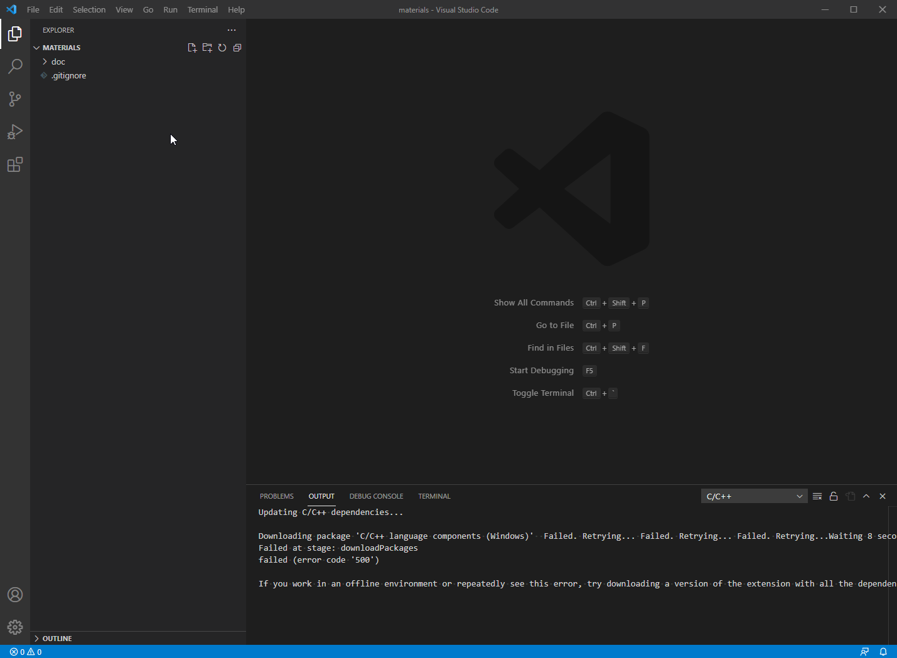

# Title

sdhfguiershgushgjshgjuek

We need to search for `while(1)` 

```c
/* USER CODE BEGIN WHILE */
  while (1)
  {
    /* USER CODE END WHILE */

    /* USER CODE BEGIN 3 */
  }

```

Image about how to do something


[Link](www.st.com)

